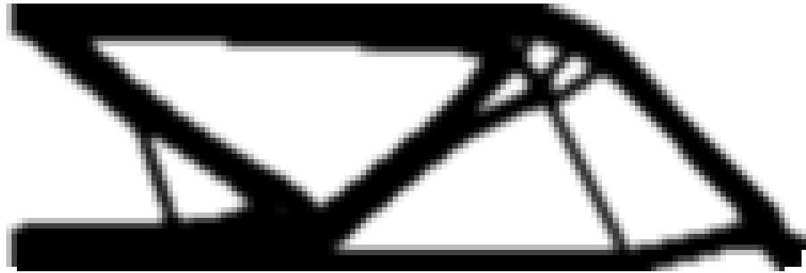

# IbIPP
 **IbIPP** which stands for Image-based Initialization and Post-Processing
 is an open-source code for initializing and post-processing free-form 2D topology optimization problems.
 

 ## Syntax
 * **ibipp(*file*, *nelx*, *volfrac*)** Performs topology optimization on the image provided in *file* using the number of elements in the x-direction *nelx*, the required volume fraction *volfrac*, and other default parameters.

 * **ibipp(*file*, *nelx*, *volfrac*,*fmag*,*fang*)** Performs topology optimization using *file*, *nelx*, *volfrac*, vectors of force magnitudes *fmag*, and force angles *fang*, and other default parameters.

 * **ibipp(...,'PropertyName',VALUE,'PropertyName',VALUE,...)** performs topology optimization using the following property values:
 ### Table 1: Name-value inputs
--------------------------------------------------------------------------------------------------------------------
 |    Name-value     |                      Description          |    Value                          |
 |-------------------|---------------------------------------------------------|-----------------------------------|
 |  pressure         |   Pressure loads (multiple loads must be in a vector)   |                                   |
 |  optimization     |   Type of topology optimization approach                |  Density, BESO, Level Set         |
 |  densityType      |    Type of density-based method                         |  SIMP, RAMP                       |
 |  preserveSupport  |  Preserve elements within the support region in the image |  0 – none                       |
 |                   |                                                         | 1 – Only completely fixed elements|
 |                   |                                                         | 2 – Only elements fixed in the x-axis|
 |                   |                                                         | 3 – Only elements fixed in the y-axis|
 |                   |                                                         | 4 – the union of 1 and 2|
 |                   |                                                         | 5 – the union of 1 and 3|
 |                   |                                                         | 6 - the union of 2 and 3|
 |                   |                                                         | 7 – the union of 1, 2, and 3|
 | preserveLoad      |  Preserve elements within the load region in the image  | 0 – none|
 |                   |                                                         | 1 – elements in the force region|
 |                   |                                                         | 2 – elements in the pressure region|
 |                   |                                                         | 3 – the union of 1 and 2  |
 |  filterRadius     |   Specify filter radius for density-based and BESO approaches | >1|
 |  filter           |   Specify filter type for density-based approaches      | 1 – density|
 |                   |                                                         | 2 – sensitivity|
 |                   |                                                         | 3 - Heaviside projection|
 |  beta             |  Regularization parameter for Heaviside projection      | >1|
 |  penaltySIMP      |  Penalty value for SIMP density-based approach          | >1|
 |  penaltyRAMP      |  Penalization factor for RAMP density-based approach    | >1|
 |  ER               |  Evolution ratio for BESO                               | >0|
 |  tau              |  Regularization parameter for level set method (reaction diffusion) | >0 |
 |  YoungsModulus    |  Youngs Modulus material property                       | >1 |
 |  PoissonRatio     |   Poisson Ratio material property                       | >0 |
 |  modelName        | Name given to model obtained by extrusion or revolution of the optimized topology. Must end in .stl |
 |  modelType        |  Modeling by extrusion or revolution                    | Extrude or revolve |
 |  extrudeLength    |  Length for extrusion - a factor multiplied by min(*nelx*,*nely*) to obtain the length of the 3rd dimension| >0 |
 |  symmetry         | Specifies the position of the line of symmetry for symmetry-based modeling | None, Left, bottom, right, and top |
 |  distancetoaxis   | Distance between the optimized topology and its revolution axis to the left for revolution-based modeling | ≥0 |
 |  revolutionAngle  | The angle of revolution for revolution-based modeling   | ≥0 |

 ###   Table 2: Color codes (RGB) for creating an input image file
 | Features              |  Color code rules                 | Recommended values  |                                     
 |-----------------------|-----------------------------------|---------------------|
 | Designable domain     |  *R*∩*G*∩*B*<200                  |     0     0     0   |
 | Non-designable domain |	*R*∩*G*∩*B*>200                  |    255   255   255  |
 | Point load            |  200≤*R*≤255, *G*=0, *B*=0        |    200    0     0   |
 | Pressure              |  200≤*R*≤230, 100≤*G*≤150, *B*=0  |   200   100    0    |
 | Preserved region      |  *R*=0, 200≤*G*≤255, *B*=0        |     0    200    0   |
 | Fixed region          |  *R*=0, *G*=0, 200≤*B*≤255        |     0     0    200  |
 | Region fixed along x	 |  100≤*R*≤150, *G*=0, 200≤*B*≤255  |   100    0    200   |
 | Region fixed along y	 |  *R*=0, 200≤*G*≤255, 200≤*B*≤255  |    0    200   200   |     
  *  Note: for multiple forces or pressure, *R* should be in multiples of 5
    starting from 200 for forces (200, 205, 210,...etc) and *G* should be
    in multiples of 5 starting from 100 for pressures (100, 105, 110,..etc)
## Examples:

The following examples show how **ibipp** can be used.
Images of some sample design problems and their corresponding input images for **ibipp** have been prepared and are in this repository. When developing an input image for a design problem, **Table 2** should be used while **Table 1** outlines the possible name-value inputs. Any image tool can be used to prepare the input file but .png is the preferred file extension.

  *  Example 1:
    Optimize a half-MBB using default values of optional inputs
     - **ibipp('Example_pics\half_mbb.png',150,0.4)**
{height = "100px" width = "50px"}

  *  Example 2:
     Optimize a Hammerhead pier using the BESO approach
     - **ibipp('Example_pics\hammerhead.png',200,0.5,[2 1 1 2],[180 180 180 180],'optimization','BESO','filterRadius',3)**

  *  Example 3:
     Optimize a 2-point loading mechanical part while preserving load and support elements
     - **ibipp('Example_pics\2point.png',300,0.45,[1 1],[0 0],'optimization','levelset','tau',5e-5,'preserveLoad',1,'preserveSupport',1)**

  *  Example 4:
     Optimize a half-spanner design and generate an extruded full spanner STL model
     - **ibipp('Example_pics\half_spanner.png',250,0.5,'pressure',[1,1],'preserveload',2,'preservesupport',1,'modelname','spanner.stl','symmetry','right','modeltype','extrude','extrudelength',0.2)**

## Supporting Open-Source Codes
**IBIPP** utilizes other open-source codes such as [top88.m](https://www.topopt.mek.dtu.dk/apps-and-software) by
Andreassen et.al, [esoL.m](https://link.springer.com/article/10.1007/s11831-016-9203-2) by Xia et. al., [levelset88.m](http://www.osdel.me.kyoto-u.ac.jp/members/yamada/codes.html.) by Otomori et.al,
[revolve2D.m](http://www.k-wave.org/) by Treeby and Cox, and [stlwrite.m](https://www.mathworks.com/matlabcentral/fileexchange/20922-stlwrite-write-ascii-or-binary-stl-files) by Sven.
